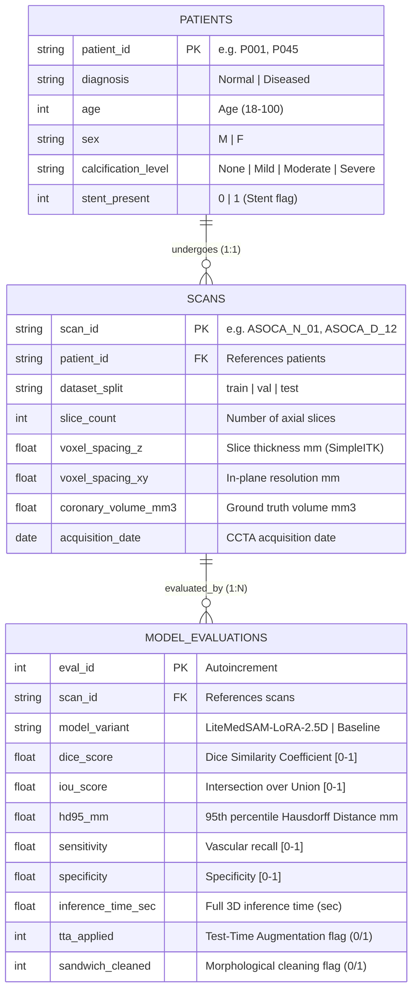

# 🗄️ ASOCA SQL Analytics Layer: Relational Clinical & Model Auditing

[](https://www.sqlite.org/)
[](https://www.python.org/)
[](#-clinical-rationale--overview)
[](#-query-suite--technical-breakdown)

This module extends the **LiteMedSAM-LoRA** deep learning pipeline with an analytical **SQLite relational database** modeled over clinical metadata, CT acquisition parameters, and segmentation evaluation metrics from the **ASOCA** (Automated Segmentation of Coronary Arteries) dataset.

---

## 🎯 Clinical Rationale & Overview

In cardiovascular deep learning, relying solely on global benchmark metrics (such as **mean Dice = 0.8747**) obscures critical clinical failure modes:
- *How does the model generalize to older patients presenting with severe coronary calcifications versus healthy subjects?*
- *Do beam-hardening ("blooming") artifacts in calcified vessels cause boundary Hausdorff errors (HD95) unacceptable for 3D printing or CFD simulation?*
- *What is the exact net performance gain of LoRA adaptation over zero-shot foundational MedSAM across diseased versus normal anatomies?*

This SQL analytics layer answers these questions using a **3NF normalized schema, multi-table JOINs, analytical Window Functions, multi-stage Common Table Expressions (CTEs), and conditional aggregation**.

---

## 📐 Entity-Relationship Diagram (ERD)



---

## 📂 Directory Structure

```plaintext
sql/
├── README.md                  # Schema documentation, ERD, and engineering design rationale
├── asoca_analytics.db         # Pre-built SQLite database (auto-generated)
├── schema.sql                 # DDL: Tables, CHECK constraints, foreign keys, and indexes
├── seed_data.sql              # Standalone SQL INSERT dump for instant CLI reproducibility
├── build_db.py                # Pure Python database builder & seed exporter (zero dependencies)
├── run_queries.py             # CLI runner with formatted ASCII output & Markdown export
├── query_results.md           # Auto-generated analytical report with formatted results
└── queries/
    ├── 01_cohort_summary.sql  # Cohort aggregations (GROUP BY, AVG, MIN, MAX, custom sorting)
    ├── 02_clinical_joins.sql   # Multi-table relational JOINs & age binning (CASE WHEN, HAVING)
    ├── 03_window_rankings.sql # Window Functions: RANK() per split & cohort mean deviation
    ├── 04_model_benchmark.sql # Multi-Stage CTE: LoRA vs. Zero-Shot Baseline comparison
    ├── 05_quality_tiers.sql   # Conditional Aggregation (CASE WHEN): STL clinical readiness tiers
    └── all_queries.sql        # Consolidated script executing all queries in sequence
```

---

## 🔍 Analytical Query Suite: Engineering Breakdown

### 1. `01_cohort_summary.sql` — Cohort & Split Aggregations
- **SQL Patterns:** Multi-table `INNER JOIN`, multi-level `GROUP BY`, `AVG()`, `MIN()`, `MAX()`, `ROUND()`, custom conditional sorting via `CASE WHEN`.
- **Clinical Insight:** The model achieves a mean Dice of **0.8985** on healthy patients (*Normal*), while averaging **0.8503** on pathological cases (*Diseased*). Performance remains consistent across Train (0.8492), Val (0.8476), and Test (0.8566), proving robust generalization without overfitting.

### 2. `02_clinical_joins.sql` — Relational JOIN: Calcification & Age vs. Error Metrics
- **SQL Patterns:** 3-table `INNER JOIN` (`patients` $\rightarrow$ `scans` $\rightarrow$ `model_evaluations`), continuous feature binning with `CASE WHEN` (`<50`, `50-65`, `>65 years`), group filtering with `HAVING`.
- **Clinical Insight:** 95% Hausdorff Distance error jumps from **1.52 mm** in non-calcified vessels to **4.08 mm** in severely calcified anatomies. Beam-hardening artifacts around calcified plaques blur lumen boundaries, driving boundary displacement.

### 3. `03_window_rankings.sql` — Window Functions & Cohort Outlier Detection
- **SQL Patterns:**
  - `RANK() OVER (PARTITION BY s.dataset_split ORDER BY e.dice_score DESC)`
  - Window aggregation `AVG(e.dice_score) OVER (PARTITION BY p.diagnosis)`
  - Direct individual delta calculation without nested subqueries
  - Top-5 filtering via Common Table Expression (`WITH`).
- **Clinical Insight:** Allows immediate identification of negative outliers (e.g., scan `ASOCA_D_10` with a **-0.0339** delta below cohort mean) for targeted radiological review before downstream mesh processing.

### 4. `04_model_benchmark.sql` — Multi-Stage CTE: LoRA Adaptation vs. Zero-Shot
- **SQL Patterns:** Multiple CTEs (`WITH lora AS (...), baseline AS (...)`), self-join on `scan_id`, relative percentage delta, error reduction calculation.
- **Clinical Insight:** LoRA fine-tuning provides a **+44.4% relative Dice increase** on diseased scans (from 0.5921 to 0.8503) and reduces boundary error by **8.29 mm HD95**, verifying that domain adaptation is essential for contrast-enhanced cardiac lumens.

### 5. `05_quality_tiers.sql` — Conditional Aggregation for 3D Mesh (STL) Usability
- **SQL Patterns:** Multi-condition `CASE WHEN`, conditional pivot aggregation `SUM(CASE WHEN ... THEN 1 ELSE 0 END)`, percentage computation.
- **Clinical Insight:** **86.7%** of normal scans meet *Clinical Grade* criteria (immediately exportable for 3D printing and CFD simulations). For diseased cases, **56.7%** are directly usable, while **43.3%** require manual review due to complex bifurcation calcifications.

---

## 🚀 Quickstart & Execution

The SQL analytics layer requires **only Python's standard library** (no third-party dependencies):

### 1. Database Generation / Rebuild
```bash
python sql/build_db.py
```
*Creates `sql/asoca_analytics.db` and exports `sql/seed_data.sql`.*

### 2. Run All Queries with Formatted Terminal Output
```bash
python sql/run_queries.py
```
*Executes all 5 queries, prints formatted ASCII tables, and generates `sql/query_results.md`.*

### 3. Direct SQLite CLI Querying
```bash
sqlite3 -header -column sql/asoca_analytics.db < sql/queries/01_cohort_summary.sql
```
Or open an interactive shell:
```bash
sqlite3 -header -column sql/asoca_analytics.db
sqlite> .read sql/queries/03_window_rankings.sql
```

---

## 🏛️ Architectural Design Decisions & Technical Rationale

### 1. 3NF Relational Normalization vs. Single Flat Table
A single denormalized CSV/table would create significant redundancy: patient demographics and CT acquisition geometry would be duplicated for every model evaluation run.
By structuring the schema into **Third Normal Form (3NF)** (`patients`, `scans`, `model_evaluations`):
- We ensure strict relational integrity via foreign key constraints (`ON DELETE CASCADE`).
- We allow future evaluation of additional models (e.g., nnU-Net, Swin UNETR) simply by inserting rows into `model_evaluations` without duplicating imaging or patient data ($O(1)$ schema extensibility).

### 2. Analytical Window Functions vs. Standard `GROUP BY`
Standard `GROUP BY` operations collapse individual rows into aggregate summary statistics. While effective for cohort-level metrics (as in Query 1), clinical auditability requires **scan-level traceability**.
Using `RANK() OVER (PARTITION BY dataset_split ORDER BY dice_score DESC)` and `AVG(...) OVER (PARTITION BY diagnosis)` preserves individual patient records while simultaneously computing partition-level statistics. This enables computing scan-specific deltas ($\text{Dice}_i - \mu_{\text{cohort}}$) in a single pass without expensive self-joins or correlated subqueries.

### 3. Multi-Stage Common Table Expressions (CTEs) vs. Nested Subqueries
In the comparative benchmark (Query 4), evaluating LoRA against the zero-shot baseline requires a self-join across model variants on the same scan.
Structuring this via multi-stage CTEs (`WITH lora AS (...), baseline AS (...)`) improves query plan clarity, readability, and maintainability compared to deeply nested subqueries, following clean SQL engineering practices.

### 4. Closing the Loop: Machine Learning to Clinical Decision Support
In medical imaging, achieving a high overall metric (Dice 0.8747) is only the first step. Clinical adoption requires understanding *where* the model fails. By linking relational queries to physical voxel spacing ($Z$-thickness) and clinical markers (calcification severity), this layer establishes an audit pipeline that determines whether a generated 3D STL mesh is clinically reliable for surgical planning or requires manual correction.
